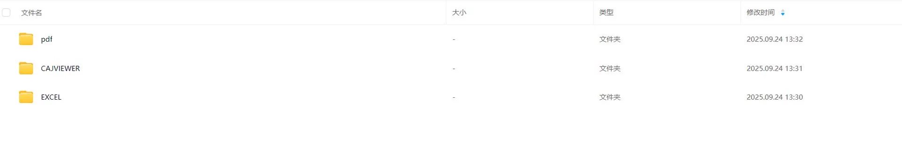
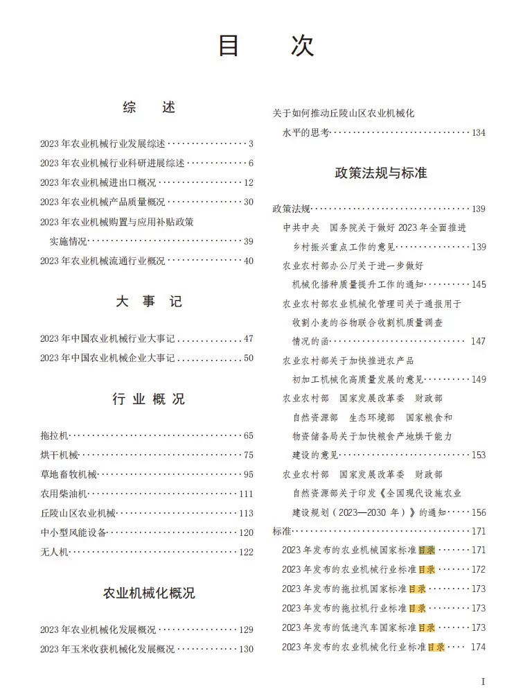
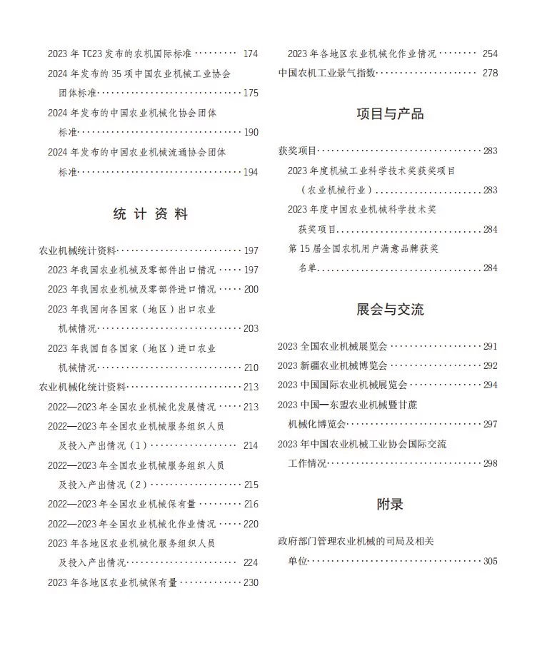
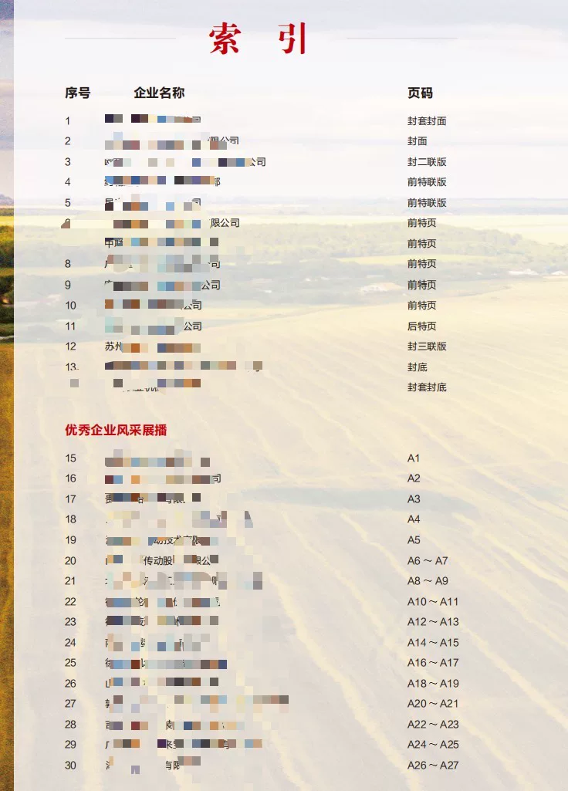
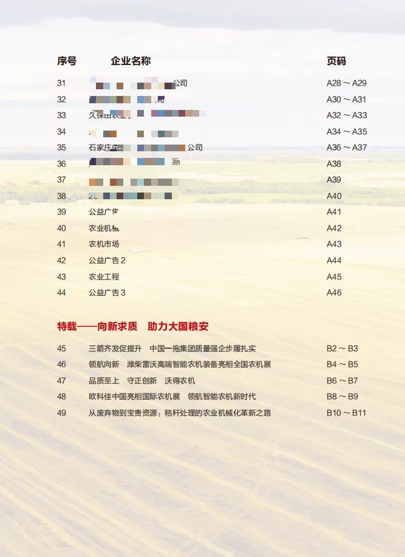

## Body

《China Agricultural Machinery Industry Yearbook》（1987-2024）

Data Period: The yearbook covers the years from 1987 to 2024. (The data year is one less than the yearbook year.)
PS. No years 88-91 are included.

01. Data Introduction
The China Agricultural Machinery Industry Yearbook

02. Index Details
The directory is displayed in the picture, please view it on your own and purchase accordingly. If you need help finding specific data, all information is here. After shipping, returns without reason are not supported.
The display directory is for the year 2024. Different statistical methods may change over time. Academic knowledge states that the data recorded in the yearbook is also academically accepted as the previous year's data. Please be aware of this.

03. Data Content
Format: PDF (1987-2024), Excel (1987-2022), CajViewer (2000-2022). Some files are zipped, which require downloading first before unzipping. Please read carefully before purchasing, if you are sensitive to format, do not purchase.

## Images

item_978983967343

Here is a pay link on Stripe ( https://buy.stripe.com/3cs8yP7sY87d0vu9AB ). Please contact me lonlonago@foxmail.com after funding $89, and I will send you a complete data files , thank you!

